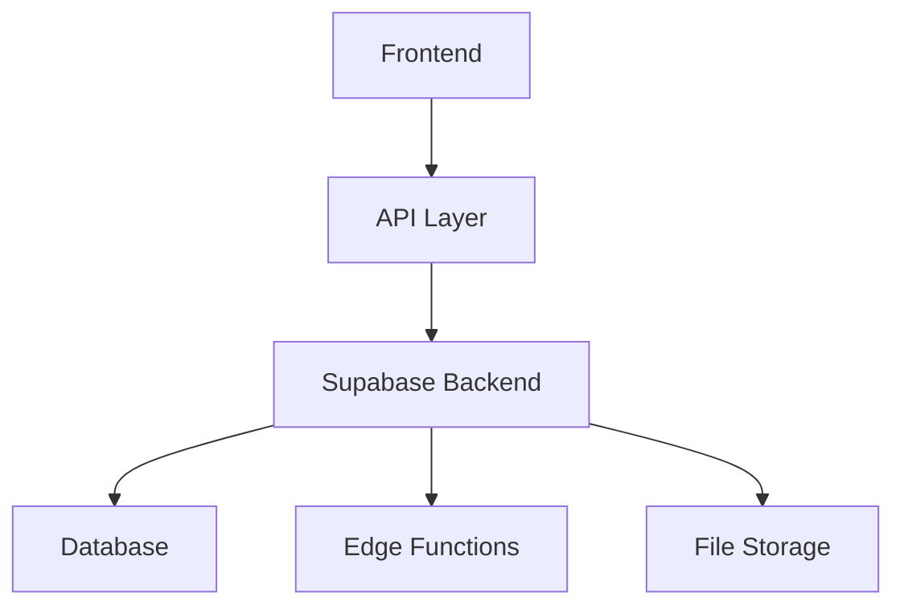

# Raider Architecture

## Overview

Raider is built with a modern, scalable architecture using React and Supabase, designed for high performance and reliability.

## Technical Stack

### Frontend
- React with TypeScript
- TanStack Query for state management
- Shadcn/UI components
- Tailwind CSS

### Backend
- Supabase
- PostgreSQL database
- Edge Functions
- Real-time subscriptions

## System Components

## Data Flow

1. User Interface
2. API Layer
3. Backend Processing
4. Data Storage
5. Real-time Updates

## Security Architecture

- Role-based access control
- API key management
- Encrypted storage
- Audit logging